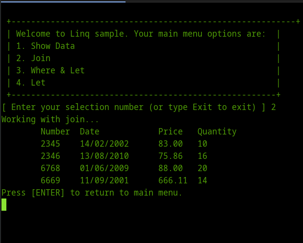

# Ejemplos con Join,Let y Where utilizando LINQ con C#
		

LINQ cuyo acrónimo significa <b>Language INtegrated Query</b> es un lenguaje declarativo con una sintaxis tipo SQL para consultar, buscar y manipular datos en estructuras y colecciones de .NET. Estas operaciones denominadas query expressions se aplican a Objetos, Datatables, Archivos XML, entidades, Schemas, llaves de registro, archivos de Excel,Objetos de WMI, etc.

Desde su aparición como una extensión a la versión 3.5 de Microsoft .NET, ha sido una poderosa herramienta que unifica las técnicas de acceso a datos en un modelo orientado a objetos .NET independiente de la fuente de datos.

Para ilustrar algunos ejemplos, usaré colecciones de las siguientes clases que representan la relación entre entre una factura y sus detalles como parte de una entidad factura (esto se supone en un sistema de facturación).

 
<!--Code invoiceData-->

Bien ahora unos programas como ejemplos.

<h1>El operador <b>Join</b></h1>

El operador Join funciona para encontrar la intersección entre dos colecciones de datos en base a un criterio, similar al INNER JOIN de SQL.

En este programa las colecciones a unir son:

<pre>
var invoices = InvoiceData.GetInvoices ();
var details = InvoiceData.GetDetails ();
</pre>

El código de la consulta utilizando <b>Join</b> es el siguiente:

<pre>
var queryjoin = from invoice in invoices
  join detail in details on invoice.InvoiceNumber equals detail.InvoiceNumber
 select new Invoice
 {
  InvoiceNumber = invoice.InvoiceNumber,
  Created = invoice.Created,
  Details = new InvoiceDetails
  {
   InvoiceNumber = detail.InvoiceNumber,
   ProductPrice = detail.ProductPrice,
   Quantity = detail.Quantity
  }
 } ;
</pre>

Para compilar y ejecutar el programa con <a href="http://www.mono-project.com/">Mono</a> se utilizan los siguientes comandos:
<ul>
<li><tt>mcs /t:library Invoice.cs InvoiceData.cs InvoiceDetails.cs /o:LinqSamples.dll </tt></li>
<li><tt>mcs -r:Invoice.dll Main.cs</tt></li>
<li><tt>mono Main.exe</tt></li>
</ul>

Aquí la imagen del programa en ejecución.

 
<h1><b>El operador Let</b></h1>

Este operador permite calcular valores cuando se trabaja con múltiples colecciones de datos, en este ejemplo asignamos el valor de la propiedad <i>Subtotal</i> en la clase <i>Invoice</i>.

<!-- Code Let -->

La consulta utilizando <b>Let</b> queda de la siguiente manera:

<pre>
var queryLet = from invoice in invoices
 join detail in details on
 invoice.InvoiceNumber equals detail.InvoiceNumber
 let subtotal = detail.ProductPrice * detail.Quantity
 select new Invoice
 {
  InvoiceNumber = invoice.InvoiceNumber,
  Created = invoice.Created,
  Details = new InvoiceDetails
  {
   InvoiceNumber = detail.InvoiceNumber,
   ProductPrice = detail.ProductPrice,
   Quantity = detail.Quantity
  } ,
  Subtotal = subtotal
 } ;
</pre>

El resultado al ejecutar este programa es el siguiente:

 
<h1><b>El operador Where</b></h1>

Si necesitamos múltiples criterios de selección podemos agregarlos con la palabra  where justo después de los operadores let y join.

El resultado al ejecutar este programa es el siguiente:

 
